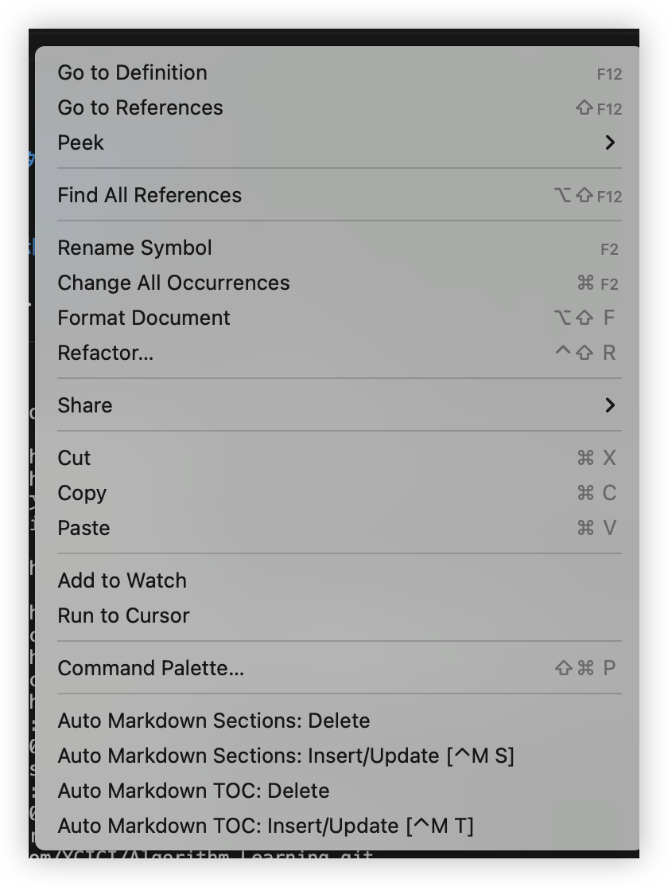
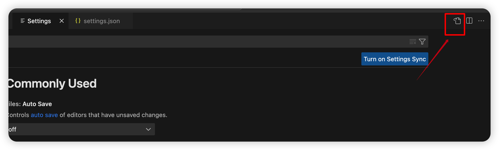
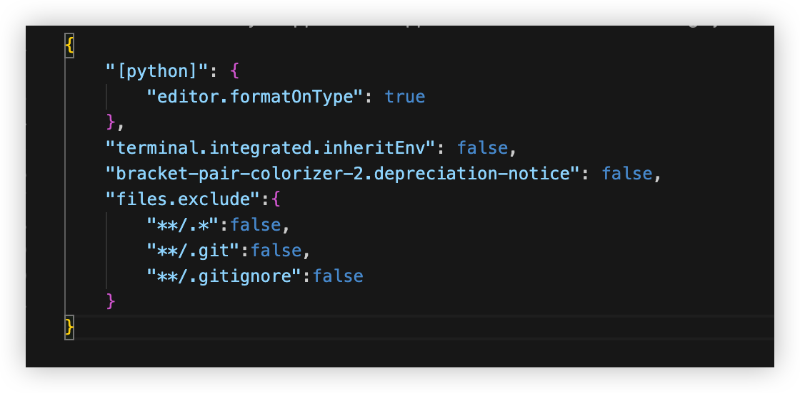

<!-- TOC -->

- [1、下载版本VScode](#1下载版本vscode)
- [2、配置基础插件](#2配置基础插件)
  - [2.1 python类](#21-python类)
  - [2.2 Markdown类](#22-markdown类)
- [3、额外功能配置(可选)](#3额外功能配置可选)
  - [3.1 显示隐藏文件](#31-显示隐藏文件)

<!-- /TOC -->


### 1、下载版本VScode


### 2、配置基础插件

#### 2.1 python类

#### 2.2 Markdown类

[① Auto Markdown TOC](https://marketplace.visualstudio.com/items?itemName=xavierguarch.auto-markdown-toc)

**功能：** 
markdown自动生成目录

**说明：** 
    一些网站编辑markdown支持[TOC]自动生成目标，但是vscode的markdown编辑暂时无法支持，可以使用插件[Auto Markdown TOC](https://marketplace.visualstudio.com/items?itemName=xavierguarch.auto-markdown-toc)。

**使用方式：** 右键，菜单栏下方会出现
> Markdown TOC:Insert/Update 菜单项用于插入和更新目录。  
> Markdown Sections:Insert/Update菜单项用于自动给标题添加多级排序的序号。
> Delete是删除的意思，剩下的带delete的两个菜单项用于删除目录或者删除多级排序。




### 3、额外功能配置(可选)


#### 3.1 显示隐藏文件
    
* 打开code -> preferences -> settings

* 点击setting.json，如下图


* 在setttingl.json配置以下代码
```json
 "files.exclude":{ 
         "**/.*":false,
         "**/.git":false,
         "**/.gitignore":false
            }
```



