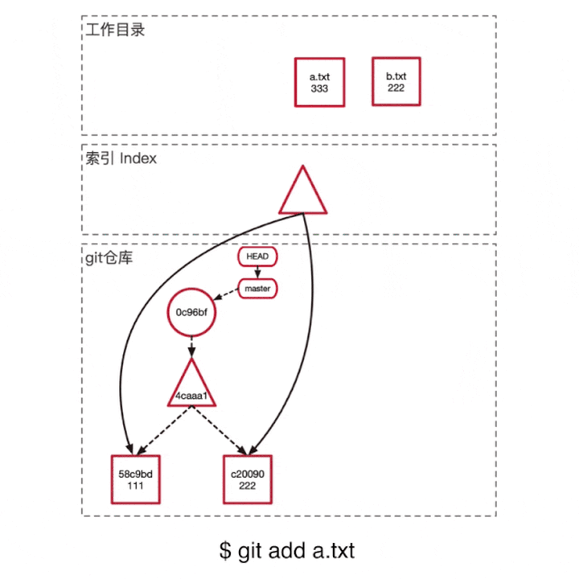
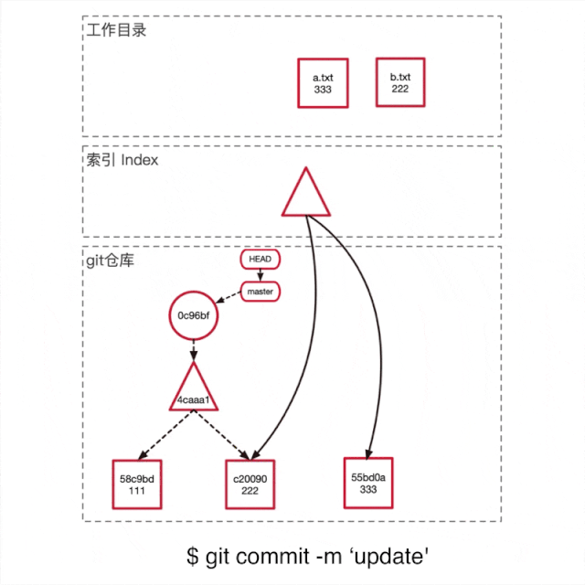

<!-- TOC -->

- [一、git的三种状态](#%E4%B8%80git%E7%9A%84%E4%B8%89%E7%A7%8D%E7%8A%B6%E6%80%81)
- [二、示例图解](#%E4%BA%8C%E7%A4%BA%E4%BE%8B%E5%9B%BE%E8%A7%A3)

<!-- /TOC -->

参考文档：  
[1、官方git说明](https://git-scm.com/book/zh/v2/Git-%E5%9F%BA%E7%A1%80-%E8%8E%B7%E5%8F%96-Git-%E4%BB%93%E5%BA%93#ch02-git-basics-chapter)    
[2、这才是真正的Git——Git内部原理揭秘！](https://zhuanlan.zhihu.com/p/96631135)

## 一、git的三种状态

所有的git仓库有三种状态：

> 已修改（modified）： 文件已修改，但是没有暂存；     
> 已暂存（staged）： 修改文件已暂存，但是没有提交；   
> 已提交（committed）： 已提交，指针指向已更新；

对应的是三个区域：

> 工作目录(work directory): 修改文件的地方；  
> 暂存区(staging area): 修改后的文件，根据git的方式存储(直接编码存储，不会跟原文件进行比较)，会在下一次的commit提交到仓库；  
> git目录(git directory/repository): HEAD指针指向的地方；

## 二、示例图解

参考：https://zhuanlan.zhihu.com/p/96631135

操作总共有四步  

1、修改文件，工作目录里的文件会修改，索引和仓库不会有任何变化； 

2、git add之后，修改的文件会在仓库里生产新的blob节点，同时索引更新指向最新的blob节点

3、git commit后，发生以下操作
> Git首先根据当前的索引生产一个tree object，充当新提交的一个快照。  
> 创建一个新的commit object，将这次commit的信息储存起来，并且parent指向上一个commit，组成一条链记录变更历史。   
> 将master分支的指针移到新的commit结点。

